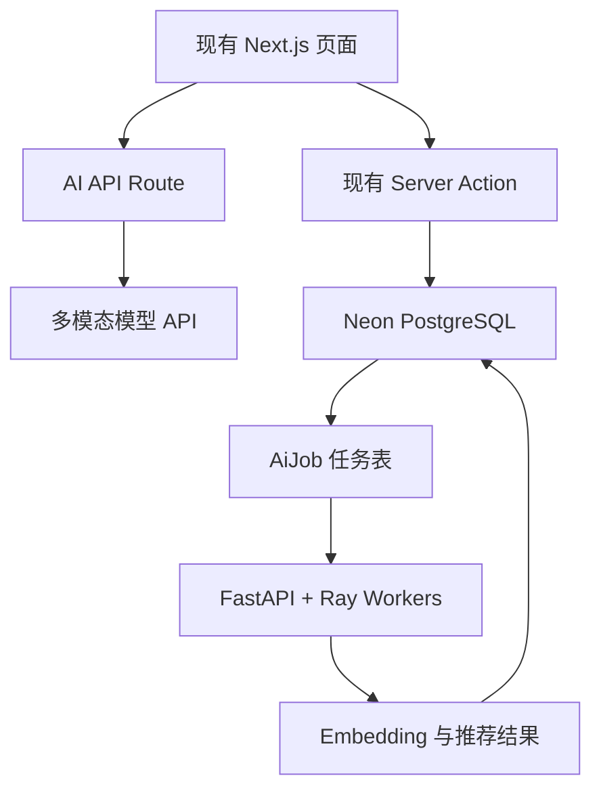

# UniSwap AI 智能发布与撮合 Feature Dev

> 目标仓库：`hhuang999/ust-inform-trade-CCF`  
> 文档用途：作为 Claude Code 的增量功能开发说明  
> 开发原则：保留现有 Next.js、Prisma、交易状态机和页面结构，只新增 AI 能力
> 开发环境: git的cff分支, conda activate vb环境

## 1. 要开发什么

在 UniSwap 现有的物品、服务、需求三条业务线之上，增加一个“AI 智能发布与撮合”功能包：

1. **AI 辅助发布**
   - 用户发布物品时，上传图片并输入一句简单描述。
   - AI 自动生成标题、描述、分类、成色、标签、价格方式和交易方式等表单草稿。
   - 服务和需求发布页支持根据自然语言自动生成结构化草稿。
   - AI 只负责填表，用户确认后仍调用现有发布逻辑。

2. **自然语言语义搜索**
   - 用户可以搜索“适合写代码的显示器”“周末帮忙修改英文简历”等自然语言。
   - 搜索结果同时使用现有关键词匹配和向量相似度。
   - 原有分类、价格、状态、时间等筛选条件继续生效。

3. **跨业务智能撮合**
   - 新需求发布后，自动从物品或服务中寻找候选资源。
   - 新物品或服务发布后，自动寻找相关需求。
   - 在详情页和首页展示“AI 推荐”，并显示 1～3 条可解释的推荐理由。

4. **分布式批量计算**
   - 使用 Ray 对物品、服务、需求的文本向量生成和批量匹配进行并行处理。
   - 正常用户功能不依赖 Ray 才能运行；Ray 主要负责批量重建索引、批量撮合和比赛性能演示。
   - 展示 1、2、4 个 Worker 的任务耗时和吞吐量对比。

## 2. 本次不开发什么

- 不修改现有 ItemDeal、Booking、NeedMatch 的交易状态机。
- 不让 AI 自动发布、自动选择买家、自动预约或自动完成交易。
- 不训练大模型。
- 不开发复杂的模型管理平台、A/B 平台或完整 MLOps 系统。
- 不做基于用户历史行为的深度个性化推荐。
- 不替换现有关键词搜索；语义搜索作为增强能力。

## 3. 技术选型

| 模块 | 技术 | 说明 |
|---|---|---|
| 原有 Web 应用 | Next.js 16、React 19、TypeScript | 保持现有技术栈 |
| 表单与校验 | React Hook Form、Zod | 复用现有表单和校验方式 |
| AI 草稿生成 | OpenAI-compatible 多模态模型 API | 通过统一 Provider 封装，模型和供应商由环境变量切换 |
| 文本 Embedding | BGE-M3，1024 维 | 中文、英文和中英混合文本统一向量化 |
| 向量存储 | Neon PostgreSQL + pgvector | 不增加独立向量数据库 |
| 混合检索 | PostgreSQL 关键词检索 + pgvector cosine distance | 兼顾精确型号和自然语言意图 |
| AI Worker | Python 3.11、FastAPI、Ray | 批量向量生成、批量匹配、性能演示 |
| 任务队列 | PostgreSQL `AiJob` 表 | 避免引入 Redis，Worker 轮询并抢占任务 |
| 对象存储 | 现有 Cloudflare R2 | AI 读取用户刚上传的公开物品图 |
| 测试 | Vitest + Pytest | 前后端分别测试 |

### 3.1 为什么这样选

- 项目已经使用 Neon PostgreSQL，直接增加 pgvector 的改动最小。
- 使用 PostgreSQL 任务表可以减少 Redis、Kafka 等额外部署。
- AI 模型通过兼容接口调用，开发时可以用云 API，比赛时也可以切换到校园 GPU 上部署的模型。
- Ray 只负责适合并行化的批处理，不侵入现有交易业务。

## 4. 总体实现方式



核心边界：

- Next.js 继续负责认证、权限、表单、业务写入和页面展示。
- Python AI Worker 不直接处理用户认证，也不修改交易状态。
- 所有 AI 结果都通过 PostgreSQL 与现有应用衔接。

## 5. Feature 1：AI 辅助发布

### 5.1 页面改动

在以下现有发布页面增加“AI 帮我填写”区域：

- 物品发布页
- 服务发布页
- 需求发布页

物品发布交互：

1. 用户先上传 1～9 张图片。
2. 用户输入一句补充描述，例如“毕业出 27 寸显示器，700 元左右，宿舍自提”。
3. 点击“AI 帮我填写”。
4. 页面显示生成中状态。
5. AI 结果回填到现有表单。
6. AI 填写的字段显示“AI 建议”标记。
7. 用户可以任意修改，然后使用现有提交按钮发布。

服务和需求不要求图片，用户输入一段自然语言后生成表单草稿。

### 5.2 API

新增：

```text
POST /api/ai/draft
```

请求：

```json
{
  "type": "ITEM",
  "imageKeys": ["items/xxx.jpg"],
  "text": "毕业出 27 寸显示器，700 元左右，宿舍自提"
}
```

响应：

```json
{
  "draft": {
    "title": "27 寸显示器",
    "description": "毕业闲置显示器，适合学习和办公，宿舍自提。",
    "category": "数码电子",
    "condition": "九成新",
    "priceMode": "SPECIFIC",
    "price": 700,
    "tags": ["显示器", "27寸", "学习办公"],
    "tradeMethods": ["SELF_PICKUP"],
    "pickupLocation": "宿舍区"
  },
  "warnings": [],
  "model": "configured-model"
}
```

### 5.3 代码结构

建议新增：

```text
src/
├── app/api/ai/draft/route.ts
├── components/ai/ai-draft-panel.tsx
└── lib/ai/
    ├── provider.ts
    ├── prompts.ts
    ├── schemas.ts
    └── draft.ts
```

实现要求：

- `provider.ts` 封装模型接口，不在页面或 Route 中直接写供应商 SDK 逻辑。
- `schemas.ts` 为 ITEM、SERVICE、NEED 分别定义 Zod 输出 Schema。
- 模型必须返回 JSON，服务端再次使用 Zod 校验。
- AI 返回值不能绕过现有业务表单校验。
- 图片 URL 使用短期签名，不把 R2 密钥提供给模型。
- AI 请求失败时只提示用户手工填写，不能影响正常发布。

### 5.4 验收标准

- 三类发布表单都能通过自然语言生成草稿。
- 物品发布支持图片加文字生成草稿。
- 生成结果可以修改，不会自动提交。
- 无效枚举、超长文本和非法价格不会进入表单。
- AI 服务不可用时，原有人工发布功能正常。

## 6. Feature 2：资源向量化

### 6.1 数据库扩展

启用 pgvector：

```sql
CREATE EXTENSION IF NOT EXISTS vector;
```

新增 Prisma 模型：

```prisma
enum AiTargetType {
  ITEM
  SERVICE
  NEED
}

model ResourceEmbedding {
  id          String       @id @default(cuid())
  targetType  AiTargetType
  targetId    String
  contentHash String
  model       String
  embedding   Unsupported("vector(1024)")
  createdAt   DateTime     @default(now())
  updatedAt   DateTime     @updatedAt

  @@unique([targetType, targetId])
  @@index([targetType, targetId])
}
```

因为 Prisma 暂不直接提供完整 pgvector 查询能力，向量写入和相似度查询使用参数化 `$executeRaw` / `$queryRaw`。

### 6.2 规范化文本

创建：

```text
src/lib/ai/normalize-resource.ts
```

将三类资源转换为稳定文本：

```text
ITEM:
类型=物品
标题={title}
分类={category}
成色={condition}
描述={description}
标签={tags}
价格={priceMode}:{price}
交易方式={tradeMethods}
地点={pickupLocation}
```

Service 和 Need 使用同样的“字段名=字段值”格式。不得加入真实姓名、学号、联系方式和学生证信息。

### 6.3 触发方式

在现有创建和更新 Item、Service、Need 的 Server Action 成功后：

1. 计算资源内容的 `contentHash`。
2. 向 `AiJob` 写入一个 `EMBED_RESOURCE` 任务。
3. 不等待 Embedding 完成，立即返回原有发布结果。

## 7. Feature 3：自然语言混合搜索

### 7.1 页面改动

复用物品、服务和需求列表页现有搜索框：

- Placeholder 改为“搜索关键词或直接描述你的需求”。
- 增加“智能搜索”标记。
- 查询失败时自动回退为现有关键词搜索。
- 现有分类、价格、状态、分页和排序不能失效。

### 7.2 API

新增：

```text
POST /api/ai/search
```

请求：

```json
{
  "query": "适合写代码的显示器，预算 800 以内",
  "targetType": "ITEM",
  "filters": {
    "category": "数码电子",
    "maxPrice": 800
  },
  "page": 1
}
```

### 7.3 排序方式

MVP 采用简单混合排序：

```text
finalScore =
  0.60 * semanticScore
  + 0.25 * keywordScore
  + 0.10 * freshnessScore
  + 0.05 * reputationScore
```

实现时不要一开始追求复杂模型。先保证：

- 关键词可以命中精确型号。
- 向量检索可以理解同义表达和自然语言需求。
- 数据库硬过滤先执行，AI 排序不能绕过状态、权限和价格筛选。

建议新增：

```text
src/
├── app/api/ai/search/route.ts
└── lib/ai/
    ├── embedding.ts
    ├── hybrid-search.ts
    └── search-types.ts
```

### 7.4 验收标准

- “写代码的显示器”可以召回标题没有“写代码”但描述为办公显示器的结果。
- 搜索“ThinkPad X1”仍能优先返回精确关键词匹配。
- 已删除、关闭或无权限资源不会出现。
- pgvector 或 AI 服务异常时自动回退原有搜索。
- 搜索 P95 响应时间控制在 1 秒以内。

## 8. Feature 4：跨业务智能撮合

### 8.1 撮合关系

MVP 只做以下关系：

| 来源 | 推荐目标 | 示例 |
|---|---|---|
| Need | Item | “求购显示器”匹配在售显示器 |
| Need | Service | “求英文简历修改”匹配简历辅导服务 |
| Item | Need | 新显示器匹配求购显示器的需求 |
| Service | Need | 新简历辅导服务匹配相关需求 |

### 8.2 数据库模型

```prisma
model AiRecommendation {
  id          String       @id @default(cuid())
  sourceType  AiTargetType
  sourceId    String
  targetType  AiTargetType
  targetId    String
  score       Float
  reasons     String[]
  model       String
  createdAt   DateTime     @default(now())
  expiresAt   DateTime?

  @@unique([sourceType, sourceId, targetType, targetId])
  @@index([sourceType, sourceId, score])
  @@index([targetType, targetId])
}
```

### 8.3 推荐理由

理由由规则生成，不让大模型自由编造。例如：

- “预算与商品价格匹配”
- “需求时间与服务可用时间匹配”
- “均支持线下交易”
- “内容语义高度相关”
- “地点均在宿舍区附近”

最多显示三条。没有数据库字段支持的理由不得展示。

### 8.4 页面改动

- Item、Service、Need 详情页增加“AI 为你匹配”卡片。
- 首页增加“可能适合你的资源”区域，可放在现有内容列表之后。
- 点击卡片进入现有详情页，后续仍使用“我想要”“预约”“应征”等原有动作。
- 暂不发送大量推荐通知；MVP 只在新发布内容首次产生高分推荐时发送一条站内通知。

### 8.5 验收标准

- 发布 Need 后可以看到相关 Item 或 Service。
- 推荐结果只能包含有效状态资源。
- 不推荐用户自己的资源给自己。
- 每条推荐都展示可验证的推荐理由。
- 点击推荐后进入现有业务流程。

## 9. Feature 5：Ray 分布式批处理

### 9.1 服务结构

仓库新增：

```text
ai-worker/
├── app/
│   ├── main.py
│   ├── config.py
│   ├── db.py
│   ├── embedding.py
│   ├── matching.py
│   └── jobs.py
├── tests/
├── requirements.txt
├── Dockerfile
└── README.md
```

### 9.2 任务表

```prisma
enum AiJobType {
  EMBED_RESOURCE
  REINDEX_ALL
  MATCH_RESOURCE
  BENCHMARK
}

enum AiJobStatus {
  PENDING
  RUNNING
  SUCCEEDED
  FAILED
}

model AiJob {
  id          String      @id @default(cuid())
  type        AiJobType
  status      AiJobStatus @default(PENDING)
  targetType  AiTargetType?
  targetId    String?
  payload     Json?
  attempts    Int         @default(0)
  workerId    String?
  startedAt   DateTime?
  finishedAt  DateTime?
  error       String?
  createdAt   DateTime    @default(now())

  @@index([status, createdAt])
}
```

### 9.3 Worker 行为

- Worker 从 `AiJob` 表抢占 PENDING 任务。
- 使用数据库事务或 `FOR UPDATE SKIP LOCKED` 防止重复消费。
- 单资源发布时执行 `EMBED_RESOURCE` 和 `MATCH_RESOURCE`。
- 管理员触发 `REINDEX_ALL` 时，将全部有效资源分片后交给 Ray Worker 并行处理。
- 每个任务最多重试三次，错误写入 `error` 字段。

### 9.4 比赛展示

新增一个简单管理员页面：

```text
/admin/ai-benchmark
```

页面只需要展示：

- 待处理、运行中、成功、失败任务数。
- Worker 数量。
- 最近一次批处理总耗时。
- 每秒处理资源数。
- 1、2、4 Worker 的耗时柱状图或数据表。

比赛演示步骤：

1. 准备一批独立测试数据。
2. 分别使用 1、2、4 个 Worker 重建向量并撮合。
3. 展示任务被分片到不同 Worker。
4. 展示总耗时和吞吐量变化。

真实生产业务数据与性能测试数据必须分开。

## 10. 环境变量

新增：

```env
# 多模态/文本生成模型
AI_BASE_URL=
AI_API_KEY=
AI_CHAT_MODEL=

# Embedding
AI_EMBEDDING_BASE_URL=
AI_EMBEDDING_API_KEY=
AI_EMBEDDING_MODEL=
AI_EMBEDDING_DIM=1024

# Python Worker 内部鉴权
AI_WORKER_SECRET=

# 功能开关
AI_DRAFT_ENABLED=true
AI_SEARCH_ENABLED=true
AI_RECOMMENDATION_ENABLED=true
```

环境变量未配置时，应用应自动隐藏对应 AI 入口或回退到原有功能。

## 11. 推荐开发顺序

### Step 1：AI 草稿生成

- 建立 AI Provider、Zod Schema 和 `/api/ai/draft`。
- 先完成物品发布，再复用到服务和需求。
- 不修改数据库。

完成标志：三类表单可以生成并回填草稿。

### Step 2：pgvector 与资源向量

- 添加 pgvector migration。
- 添加 `ResourceEmbedding`、`AiJob`。
- 发布或更新资源后自动创建任务。
- 先用单 Worker 跑通 Embedding。

完成标志：三类资源都有可更新的向量记录。

### Step 3：混合搜索

- 实现向量召回、关键词召回和混合排序。
- 接入现有三个列表页。
- 加入故障回退。

完成标志：自然语言搜索可用，原筛选条件不变。

### Step 4：智能撮合

- 添加 `AiRecommendation`。
- 实现 Need 与 Item/Service 的双向匹配。
- 接入详情页和首页。

完成标志：新发布资源可以获得相关候选和推荐理由。

### Step 5：Ray 批处理与展示

- 将单 Worker 逻辑封装为 Ray Task。
- 增加批量重建和 benchmark。
- 增加 `/admin/ai-benchmark`。

完成标志：可以稳定展示 1、2、4 Worker 的性能对比。

## 12. 测试要求

至少增加以下测试：

### Next.js / Vitest

- AI JSON 输出 Schema 校验。
- 规范化文本不包含联系方式和实名信息。
- 混合分数计算。
- 状态和权限硬过滤。
- AI 不可用时的搜索回退。
- 推荐理由只能来自允许的规则模板。

### Python / Pytest

- Worker 抢占任务不会重复执行。
- Embedding 批处理按指定大小分片。
- 失败任务最多重试三次。
- 重复执行同一资源不会生成重复向量或推荐。

### 回归检查

每个阶段完成后运行：

```bash
pnpm typecheck
pnpm lint
pnpm test
pnpm build
```

## 13. 最终交付结果

开发完成后，项目应实现：

- 用户可以通过图片和一句话快速生成发布草稿。
- 用户可以使用自然语言搜索物品、服务和需求。
- 系统可以在需求与现有资源之间主动生成推荐。
- AI 推荐能解释“为什么匹配”。
- AI 故障不会破坏原有发布、搜索和交易功能。
- 管理员可以运行 Ray 批量任务并展示多 Worker 性能对比。

## 14. 给 Claude Code 的执行约束

将本文档交给 Claude Code 后，建议附带以下要求：

```text
请严格基于现有仓库做增量开发，不重写已有页面和交易状态机。
每次只实现一个 Step，完成后运行 typecheck、lint、test 和 build。
先阅读相关页面、Server Action、Zod 校验和 Prisma 模型，再修改代码。
所有 AI 功能必须有 feature flag 和非 AI 降级路径。
禁止把联系方式、学生证、真实姓名等敏感信息发送给模型。
数据库迁移必须向前兼容，不删除现有字段和数据。
每完成一个 Step，输出修改文件、数据库变化、测试结果和下一步。
```
